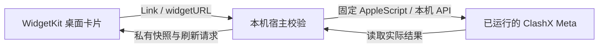

# 开发与实现说明

本文面向维护者。普通使用者直接[下载安装包](https://github.com/TomyDeskLab/clash-meta-widget/releases/tag/v1.0.0-preview.2)，不需要开发工具。

## 构建与安装

推荐使用已安装完整 Xcode 的开发环境：

```bash
bash build.sh
bash script/install.sh --skip-xcode-build
```

构建脚本生成工程、编译 arm64 与 x86_64、验证签名完整性并运行输入检查。产物在 `build/native/Build/Products/Release/Clash Meta Switch.app`。安装脚本先把原安装版移到废纸篓，并注销原扩展及构建副本，只注册应用程序目录中的版本。

`build-lite.sh` 保留仅用 Apple Command Line Tools 编译的实验路线，不调用 `xcodebuild`；当前版本的完整桌面行为尚未按此路线验收，不作为公开安装包默认构建方式。`script/install.sh` 不传参数时选择该实验路线，维护者应显式使用 `--xcode` 或上面的 `--skip-xcode-build`。

## 打包

```bash
bash script/package-release.sh
```

默认先用 Xcode 构建。也可以打包已验收的产物：

```bash
bash script/package-release.sh --app '/Applications/Clash Meta Switch.app'
```

输出为 `build/release/build<构建号>/` 下的 ZIP 与 SHA-256 文件，不覆盖已有归档。公开发行前核对包内架构、签名、解压内容、下载一致性和实际操作，记录未覆盖范围。

`docs/github-actions-build.yml` 是可选工作流模板；项目默认不启用远程构建。所有本地 `build/` 内容均被 Git 忽略，不提交证书、配置、节点信息或操作凭据。

## 架构



界面是原生 WidgetKit，动作通过系统链接唤起宿主，当前不采用 App Intent 后台按钮。macOS 可能改变前台焦点，并负责卡片的实际刷新时刻。默认启动和普通操作不打开窗口，只有明确的设置入口才显示节点管理窗口。

宿主使用固定的 ClashX Meta `toggleProxy` AppleScript 命令控制系统代理。模式、策略组和测速通过固定主机 `127.0.0.1` 的 API；测速仅调用指定节点延迟接口，最多并发 3 项，不发送选择或模式变更。

操作链接使用稳定的 256 位本地随机凭据，允许缓存卡片重复使用。它不防重放，不能分享。扩展只读快照，宿主写入前设置私有权限并原子替换。详细安全取舍见 [SECURITY.md](../SECURITY.md)。

## 文件导航

| 文件 | 用途 |
| --- | --- |
| `native/Widget.swift` | 桌面卡片 |
| `native/Host.swift` | 后台同步、设置窗口、测速调度 |
| `native/Bridge.swift` | 快照与操作链接校验 |
| `native/Core.swift` | Meta API、端口设置与钥匙串 |
| `native/Intent.swift` | 官方 AppleScript 系统代理开关；不含 App Intent |
| `native/ProxyState.swift` | 读取并检查系统代理 |
| `tests/main.swift` | 输入与代理状态检查 |
| `tests/delay-smoke.swift` | 自愿执行的真实测速检查 |

## 参考与许可

- [Apple WidgetKit](https://developer.apple.com/documentation/widgetkit)
- [Meta 控制接口](https://wiki.metacubex.one/api/)
- [ClashX Meta 官方快捷命令](https://github.com/MetaCubeX/ClashX.Meta/blob/master/Shortcuts.md)

项目独立实现，采用 MIT 许可证。曾研究 Hako-Client 的 WidgetKit 结构，没有复制、链接或包含其源码、内核或资源。
