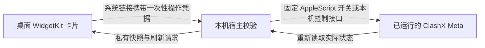

# Clash Meta 原生桌面小组件：使用与实现说明

更新日期：2026 年 9 月 20 日

当前共享版：1.0，构建 7

应用位置：`/Applications/Clash Meta Switch.app`

## 1. 它到底是什么

这是使用苹果 **WidgetKit** 开发的 macOS 原生桌面小组件。“小组件”是功能名称，“WidgetKit”是开发这种功能的系统框架，两者并不是两种不同方案。

桌面卡片由 macOS 承载，可从系统“编辑小组件”里添加，由系统管理大小、桌面位置、背景和刷新。它没有创建置顶悬浮面板。

这份扩展是为本机单独开发的 ClashX Meta 配套工具，并非苹果自带的 Clash 功能，也没有修改 ClashX Meta 的安装包。它控制的是这台 Mac 正在运行的 ClashX Meta，不依赖 iPhone。

安装包包含两部分：

| 部分 | 用途 |
| --- | --- |
| WidgetKit 扩展 `MetaSwitch.appex` | 在桌面显示状态、节点与按钮，接收点击 |
| 本机宿主 `Clash Meta Switch.app` | 校验操作、调用现有 Meta、读取结果并更新小组件 |

宿主第一次启动会显示说明窗口。关闭这个窗口后程序仍可在后台工作。正常操作成功时，代码不会主动弹出选择窗口；发生错误时会显示具体原因。

## 2. 桌面上怎么用

已经放在桌面上的旧卡片如果是小号，需要先**右键卡片，切换为中号**。更新安装包不会自动改变用户在系统里选定的尺寸。若右键没有中号选项，在桌面空白处右键 → 编辑小组件 → 搜索 `Clash Meta Switch` 或 `Clash Meta`，添加中号版本。

| 操作位置 | 效果 |
| --- | --- |
| 小号卡片整张区域 | 开启或关闭本机系统代理 |
| 中号右上角电源键 | 开启或关闭本机系统代理 |
| 中号节点名左右箭头 | 按当前策略组的顺序选择上一个、下一个节点或策略选项 |
| 中号底部“规则／全局／直连” | 直接切换对应模式 |

节点切换采用左右箭头循环选择，目前没有在卡片里实现任意节点下拉菜单。每次点击后，请等当前节点名称更新再继续点；旧画面中的操作凭据在使用后会失效。

规则模式按配置中的规则分流；全局模式使用 `GLOBAL` 策略组；直连模式不通过代理转发。规则模式下，本机目前使用“曲面空间”作为组件控制的手动选择组。不同规则可以使用不同的策略组，因此组件显示的节点不代表所有连接都使用这个节点。

如果组内选的是“自动选择”或“故障转移”，组件显示其当前实际节点，左右箭头仍按父策略组的选项顺序移动，不会误把实际节点当成父组的选择位置。

开关控制的是**系统代理**，不等同于退出 Clash、停止内核或关闭 TUN/VPN。模式按钮也不会替用户开启已关闭的系统代理。

## 3. 一次点击如何生效

系统代理开关调用 ClashX Meta 自己提供的固定 `toggleProxy` AppleScript 命令。目标应用固定为 `com.metacubex.ClashX.meta`，不把外部输入拼接成脚本。

模式与节点使用固定本机地址 `127.0.0.1` 上的控制接口，默认端口为 `9090`：

| 操作 | 接口与校验 |
| --- | --- |
| 读取模式 | `GET /configs`，只解码模式字段 |
| 切换模式 | `PATCH /configs`，仅允许 `rule/global/direct`；随后读取确认 |
| 读取节点与策略组 | `GET /proxies`，只解码显示名称、类型、当前选项和可选列表 |
| 选择节点 | `PUT /proxies/{编码后的策略组名}`；操作前重新检查可选列表，操作后读取确认 |

扩展本身没有网络权限。它读取专用目录内的状态快照，通过 WidgetKit 的 `Link` / `widgetURL` 将点击交给宿主。宿主每 10 秒检查状态，有变化时请求系统刷新；系统决定实际显示时刻，因此不是实时仪表盘。

### 为什么没有直接使用 App Intent

早期 App Intent 版本在这台 Mac 的本地临时签名条件下，系统分发日志出现无法识别 Team ID 的错误，导致卡片可以显示、点击却不能执行。当前改用苹果支持的链接入口，不伪造开发者身份，也不关闭系统签名检查。

所以这里需要准确区分：**界面是原生 WidgetKit，动作通过链接唤起本机宿主；目前不是 App Intent 的后台交互实现。** macOS 可能切换前台应用，不能保证完全没有激活或焦点变化。节点和模式操作的入口仍在桌面卡片上，无须先打开节点选择窗口。

## 4. 安全设计与实际范围

- 没有新建监听端口、远程服务、遥测、自动更新下载或第三方依赖。控制接口主机固定在本机，端口可配置；请求拒绝重定向，也不经系统代理发送。
- 小组件启用 App Sandbox，只对 `~/Library/Application Support/ClashMetaSwitch/` 有窄范围只读例外；没有写入快照或网络访问权限。
- 宿主为普通本机程序，使用 Apple Events 自动化权限；不请求管理员权限，也不安装新的特权助手。它没有启用 App Sandbox，这一点与扩展不同。
- 操作链接使用 256 位安全随机凭据。模式凭据按动作区分，节点只允许私有快照和实时 Meta 列表都存在的选项；先使凭据失效，再进行变更。拒绝伪造、过期、已使用的凭据及异常 URL。
- 快照目录权限为 `0700`，文件为 `0600`，采用私有临时文件与原子替换。快照包含节点显示名称、状态和操作凭据，不保存订阅地址、节点服务器地址或密码。可选 External Controller 密钥只保存在 macOS 钥匙串。
- 当前构建使用 Hardened Runtime，没有 `get-task-allow` 权限，安装产物通过代码签名完整性检查。签名为本机临时签名，并非 Developer ID 公证发行版。

这些措施不等于“证明没有任何漏洞”。检查范围限于这份工具及本机控制路径，未审计整个 ClashX Meta、macOS 或代理服务商。

测试机的 Meta 接口当前仅监听 `127.0.0.1:9090`，本机访问无需认证；本工具没有改变它。其他本机进程可以直接访问这个接口，组件的操作凭据并不能替 Meta 接口提供认证。共享版可以在“兼容设置”中填写接口密钥，使用 Bearer 认证；密钥不会进入快照或 Git 仓库。

同一登录用户下已经取得访问权限的恶意非沙盒程序，可能读取私有快照或系统中的启动链接。因此本工具不能抵御已控制本机用户会话的攻击者；不要分享快照或带完整操作凭据的链接。

## 5. 已验证什么，还有什么待确认

| 检查项目 | 结果 |
| --- | --- |
| Release 编译、安装产物完整性 | 通过，构建 7 已生成 arm64 + x86_64 通用应用 |
| 输入与状态安全检查 | 46 项通过，覆盖伪造、过期、重放、跨动作凭据、非法节点、异常路径、端口边界、其他代理及 PAC/WPAD |
| 小组件读取状态 | 已运行的系统扩展日志确认读取成功 |
| 节点操作链路 | 经小组件同一 URL 入口切换节点，重新读取 Meta 确认，随后恢复 |
| 规则／全局／直连链路 | 三种模式均经同一 URL 入口实测，重新读取 Meta 确认 |
| 系统代理开关 | 前序版本已实测关闭并读取系统确认，随后恢复开启；构建 7 沿用该开关实现 |
| 权限与接口监听 | 扩展沙盒、宿主权限、快照文件权限已检查；系统连接表确认 Meta 仅在本机地址监听该接口 |
| 构建 7 直接点击桌面卡片及中号布局 | **尚未完成人工验收**：自动化工具不能可靠操作系统桌面组件，不能把链接链路成功当成桌面端到端成功 |

本轮控制测试结束时恢复了本轮开始时的设置：全局模式、台湾 A02 节点、系统代理开启。该记录只是测试时状态，不要求日后维持这些选择。

桌面最终验收：切为中号，点击一个模式按钮并对照 ClashX Meta；再点节点左右箭头并对照实际节点。若仍是原来的纯开关卡片，优先检查尺寸和系统是否刷新到了新版本。

## 6. 常见问题

**只有开关，看不到新增按钮。** 现有卡片仍是小号。右键改中号；若菜单仍旧，移除这张卡片后从系统小组件库重新添加中号。

**提示画面已过期。** 操作凭据已使用或状态改变。等待组件刷新后再点，避免连续点击旧画面。也可打开宿主点“刷新”。

**节点或模式不可用。** 确认 ClashX Meta 已运行。默认系统代理端口为 `7890`、控制接口端口为 `9090`；若配置不同或设置了 `secret`，展开“兼容设置”填写。控制地址固定为 `127.0.0.1`。

**开关提示没有权限。** 在系统设置 → 隐私与安全性 → 自动化中，检查是否允许 `Clash Meta Switch` 控制 ClashX Meta。无需授予辅助功能、完全磁盘访问或管理员权限。

**重启以后状态没有更新。** 目前没有安装登录启动项。打开一次 `Clash Meta Switch.app` 让宿主恢复采样，关闭说明窗口即可继续后台工作。

**小组件变成透明或灰色。** 背景与强调色由 macOS 的小组件外观设置影响。按钮图标采用有描边的样式，兼顾系统淡化显示。

## 7. 文件与维护

源码仓库根目录就是这个独立项目，核心文件如下：

| 文件 | 用途 |
| --- | --- |
| `native/Widget.swift` | 真正的桌面 WidgetKit 界面 |
| `native/Host.swift` | 后台采样、动作调度、可选的说明与管理窗口 |
| `native/Bridge.swift` | 私有快照、随机操作凭据与 URL 校验 |
| `native/Core.swift` | 固定本机地址的 Meta 接口、端口偏好与钥匙串密钥 |
| `native/Intent.swift` | 现有代理开关实现；文件名保留历史名称，当前不含 App Intent |
| `native/ProxyState.swift` | 读取系统代理，识别其他代理或 PAC/WPAD |
| `tests/main.swift` | 不修改系统设置的 46 项检查 |
| `SECURITY.md` | 更详细的安全检查记录和边界 |

在仓库根目录执行 `bash build-lite.sh`，只需 Apple Command Line Tools，不需要完整 Xcode；执行 `bash build.sh` 则使用生成的 Xcode 工程。两种方式都会构建通用应用、验证签名结构并运行检查。构建产物位于被忽略的 `build/`，不会提交；快照包含操作凭据，也不应纳入版本控制。

## 8. 参考来源

- [Apple：创建 WidgetKit 扩展](https://developer.apple.com/documentation/widgetkit/creating-a-widget-extension)：中号组件可使用多个 Link，系统将点击交给宿主处理。
- [Apple：在 Mac 上添加与调整小组件](https://support.apple.com/en-mo/guide/mac-help/mchl52be5da5/mac)：添加、调整尺寸及桌面管理方式。
- [Meta：控制接口文档](https://wiki.metacubex.one/api/)：模式与节点 API。
- [ClashX Meta：官方 Shortcuts](https://github.com/MetaCubeX/ClashX.Meta/blob/master/Shortcuts.md)：客户端控制命令；同时核对了本机应用的脚本字典。
- [Hako-Client，固定提交 b058322](https://github.com/TokenPLS/Hako-Client/tree/b05832246fcac69d13ff16df871a8d53fd394c10/apple/HakoClient)：检索过其 WidgetKit 与 VPN 控制实现。它控制自己的 NetworkExtension，不能直接给本机 Meta 使用。本工具独立实现，没有复制其代码、内核或图像资源。
